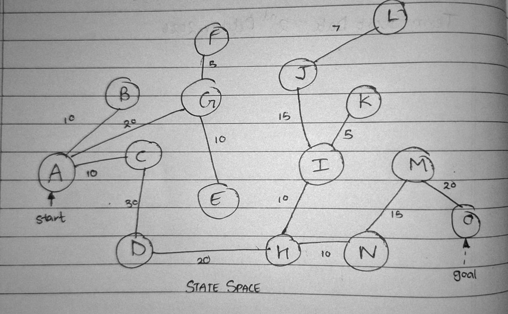

# DFS Project

A comprehensive Jupyter Notebook (`.ipynb`) demonstration showcasing DFS using Python.

---

## 📸 Featured Images

This project utilizes two primary image assets:

| Graph | DFS Traversal |
| :---: | :---: |
|  |  |
| *Figure 1: Main input image used for conceptual understanding* | *Figure 2: Secondary image used for showing the DFS traversal of same graph* |


## 🚀 Getting Started

### Prerequisites

Make sure you have Python 3.x installed along with the following libraries:


### Running the Notebook

1. Clone or download this repository.
2. Run via colab and learn!
---

## 📂 Project Structure

```text
.
├── DFS.ipynb    # Main Jupyter Notebook containing code and analysis
├── state_space.jpeg      # State Space used for conceptual understanding
├── dfs_traversal.jpeg        # DFS traversal path acquired programmaticaly
└── README.md         # Documentation file
```
