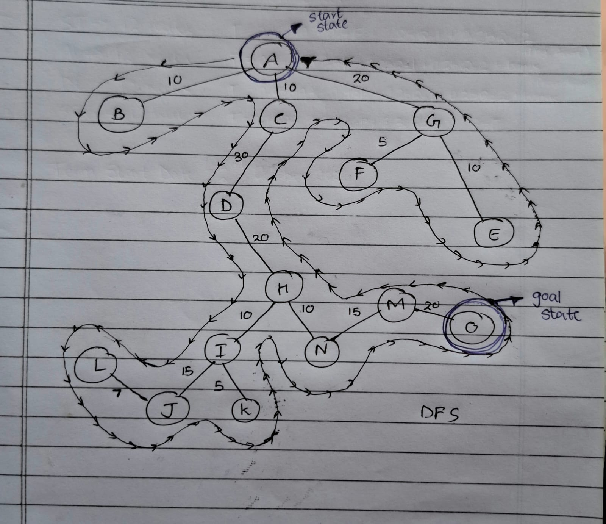

# State-Space-Searching
Me coding DFS and BFS and other cool stuff without any AI, full brute force approaches only
## DFS

[Click here](DFS/README.md) to check out the README.md for DFS 
[Click here](DFS/DFS.ipynb) to check out the DFS.ipynb
